## Hi, I am Davi Reis    ⭐

   

   -  I study Data Science 💻
   -  I am formating in statics in Escola Nacional de Ciencias Eatatisitcas -
  Instituto Brasilero de Geografia e Estatistica (The only governamental of
  Statitics in Brazil). The first course of statitics on Latin American 🎓🏫
   -  I really love my professional area 💙
   -  I live on Rio de Janeiro - RJ ✈️🌊
   -  I have a really wish to travel to annother country someday 🗺️
   -  And I am really greatuful for you view my profile 😁🫶

 
  
  
  
  
  

  
  ##
 

 
  
   
  

##
  

Curriculum

##

 
   
     

  

https://iconscout.com/lottie-animation/xml-animation_11337135

  <
<!--
**DaviReis136/DaviReis136** is a ✨ _special_ ✨ repository because its `README.md` (this file) appears on your GitHub profile.

Here are some ideas to get you started:

- 🔭 I’m currently working on ...
- 🌱 I’m currently learning ...
- 👯 I’m looking to collaborate on ...
- 🤔 I’m looking for help with ...
- 💬 Ask me about ...
- 📫 How to reach me: ...
- 😄 Pronouns: ...
- ⚡ Fun fact: ...
-->
